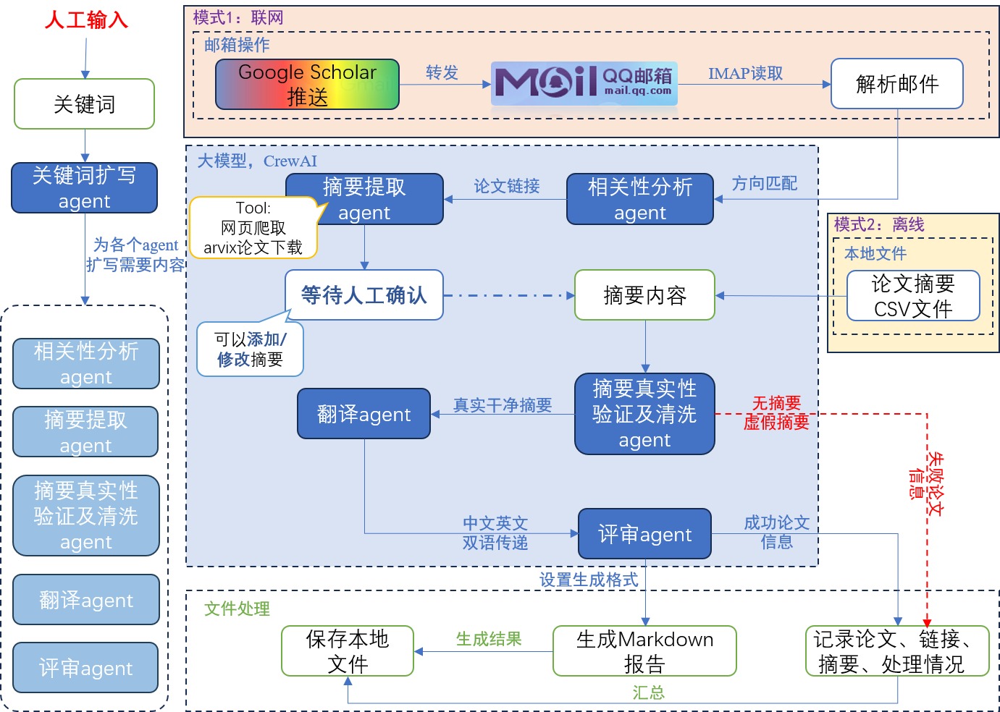

# 📚 Paper Summarizer - 学术论文自动总结系统

一个基于 AI 的自动化工具，用于从 Google 学术邮件推送中提取、翻译和评审相关论文，并生成结构化的日报报告。

## ✨ 功能特性

- 📧 **自动邮件获取**：从 QQ 邮箱自动获取 Google 学术推送邮件，支持自定义日期范围
- 💾 **邮件本地存储**：邮件信息自动保存到本地，避免重复读取，处理速度更快，还能离线查看历史邮件
- 🔍 **智能筛选**：使用 AI Agent 进行相关性分析，自动筛选相关论文（遥操作、机器人动力学、力控、灵巧手等领域）
- 🧠 **关键词智能扩写**：AI自动帮你把简短的关键词扩写成详细的研究方向描述，让AI专家更准确地理解你的研究领域
- 🌐 **智能摘要提取**：从论文原网址自动提取完整摘要，支持 PDF 和网页两种格式，使用专门的 AI Agent 和工具（arXiv 下载工具、网页内容获取工具）自动下载并精准识别摘要内容
- ✅ **摘要验证**：使用 AI Agent 验证提取的摘要是否为真实内容，防止 AI 模型虚构生成
- 🧹 **摘要清洗**：自动去除引用标记、图表引用和无意义的格式字符，使摘要更简洁易读
- 🤖 **AI 翻译**：使用 CrewAI 框架和本地 LLM（Ollama）进行专业论文翻译
- 📊 **专业评审**：自动生成结构化评审报告，包含多维度评分（创新性、技术深度、相关性、实用性）
- 🎯 **多模型评审**：支持配置多个AI模型并行评审同一篇论文，汇总专家综合分析结果，让评审更客观、更可靠
- ⚙️ **模型配置管理**：在Web界面中轻松配置、测试和管理多个AI模型（支持本地Ollama和远程API），想用哪个模型就用哪个
- 📝 **日报生成**：自动生成 Markdown 格式的学术论文日报
- ⭐ **价值评估**：自动识别高价值论文（评分>3.0）
- 📊 **CSV 导出**：所有相关论文自动导出为 CSV 表格，包含翻译后的摘要，方便查看和管理
- 💾 **备份支持**：支持将报告自动备份到指定目录
- 🐛 **调试模式**：支持开启调试模式，详细记录处理过程和 Agent 输出日志
- 💻 **本地处理模式**：支持从本地 CSV 文件读取论文信息进行处理，避免重复处理相同邮件
- 🌐 **Web 界面**：提供现代化的 Web 界面，实时显示处理进度、论文状态和 Agent 工作状态
- 📡 **实时通信**：基于 WebSocket 的实时通信，支持实时日志推送和状态更新
- 🎨 **可视化展示**：三面板布局（来源、对话、生成），直观展示论文处理流程和结果
- ✏️ **摘要确认编辑**：支持在 Web 界面中手动确认和编辑提取的摘要，确保摘要质量
- 🔗 **快速访问**：点击论文框即可在新窗口打开论文原网址，方便快速查看论文详情
- 📚 **个人知识库助手**（v0.8 新增）：基于 RAG 技术的智能问答系统，可以查询已上传的 PDF 论文内容
- 💬 **对话历史记忆**（v0.8 新增）：助手可以记住历史对话，更好地理解用户意图
- 🔍 **多维度论文查询**（v0.8 新增）：支持按作者、关键词、年份、期刊等条件查询论文
- 📄 **PDF 向量化存储**（v0.8 新增）：PDF 论文自动处理并存储到向量数据库，支持语义搜索
- 🗑️ **智能清理功能**（v0.8 新增）：自动清理无用的 PDF 文件，节省存储空间

## 🛠️ 技术栈

- **Python 3.x**
- **CrewAI** - AI Agent 框架，用于论文翻译、评审和摘要处理
- **Ollama** - 本地大语言模型（支持 qwen2.5:32b 等模型）
- **Crawl4AI** - 网页内容抓取库，用于从论文网址获取完整内容
- **PyMuPDF** - PDF 文档处理库，用于提取 PDF 论文文本
- **IMAP** - 邮件协议
- **BeautifulSoup** - HTML 解析
- **YAML** - 配置文件
- **Pandas** - 数据处理
- **Flask** - Web 服务器框架
- **Socket.IO** - WebSocket 实时通信库
- **PostgreSQL + pgvector** - 向量数据库，用于存储论文内容和向量嵌入
- **SentenceTransformer** - 文本向量化模型，用于生成论文内容的向量表示

## 📋 前置要求

1. **Python 3.8+**
2. **Ollama** 已安装并运行（默认地址：`http://localhost:11434`）
3. **已下载所需模型**（如 `qwen2.5:32b`）
4. **QQ 邮箱账号**（需要开启 IMAP 服务，仅邮件模式需要）
5. **PostgreSQL 数据库**（v0.8 新增，用于向量数据库功能）
   - PostgreSQL 12+ 版本
   - 安装 pgvector 扩展：`CREATE EXTENSION vector;`
   - 配置数据库连接信息（在 `.env` 文件中）

## 🚀 安装步骤

### 1. 克隆仓库

```bash
git clone <your-repo-url>
cd <your-repo-name>
```

### 2. 安装依赖

```bash
pip install -r requirements.txt
```

如果没有 `requirements.txt`，请安装以下依赖：

```bash
pip install crewai python-dotenv pyyaml beautifulsoup4 ollama pandas requests PyMuPDF crawl4ai flask flask-socketio psycopg2-binary sentence-transformers
```

**注意**：v0.8 版本新增了向量数据库功能，需要额外安装：
- `psycopg2-binary` - PostgreSQL 数据库驱动
- `sentence-transformers` - 文本向量化模型库

### 3. 配置环境变量

创建 `.env` 文件（不要提交到 Git）：

```env
# QQ邮箱配置
QMAIL_USER=your_qq_email@qq.com
QMAIL_PASSWORD=your_imap_password

# Ollama 配置
OLLAMA_MODEL=qwen2.5:32b
OLLAMA_BASE_URL=http://localhost:11434

# 其他配置
# MAX_EMAILS已移除，现在使用本地存储同步所有邮件

# 备份目录配置（可选）
# 如果设置了此路径，报告会同时保存到该路径
BACKUP_DIR=

# 调试模式配置（可选）
# DEBUG_MODE=1: 开启调试模式，记录详细的处理日志
# DEBUG_MODE=0: 关闭调试模式（默认）
DEBUG_MODE=0

# CSV列配置（本地模式使用）
CSV_TITLE_COLUMN=0                # 论文标题列索引（从0开始，默认第1列）
CSV_ABSTRACT_COLUMN=2             # 摘要列索引（从0开始，默认第3列）
CSV_LINK_COLUMN=                  # 论文链接列索引（可选，从0开始，如果为空则不读取链接）

# PostgreSQL 数据库配置（v0.8 新增，用于向量数据库功能）
DB_HOST=localhost
DB_PORT=5432
DB_NAME=paper_agent
DB_USER=postgres
DB_PASSWORD=your_password

# 注意：
# - LOCAL、CSV_FILE_PATH、START_DAYS、END_DAYS 等变量由前端界面动态设置，无需在此配置
# - RESEARCH_KEYWORDS 由前端界面的关键词输入框设置，无需在此配置
```

**注意**：QQ 邮箱需要使用授权码作为密码，不是登录密码。获取方式：
1. 登录 QQ 邮箱网页版
2. 设置 → 账户 → 开启 IMAP/SMTP 服务
3. 生成授权码

### 4. 配置关键词（可选）

编辑 `keywords.yaml` 文件，根据你的研究领域调整关键词。**注意**：v0.2 版本已改用 AI Agent 进行相关性分析，不再使用关键词匹配机制。关键词配置文件保留用于其他可能的用途。

文件包含三类关键词：

- **high_priority**：高优先级关键词
- **related**：相关关键词
- **exclude**：排除关键词（暂未使用）

## 📖 使用方法

### 方式一：Web 界面（推荐）

启动 Web 服务器：

```bash
python web_server.py
```

服务器启动后会自动打开浏览器访问 `http://localhost:5000`。Web 界面提供：

- **左侧面板（来源）**：配置运行模式（本地模式/远程模式）、选择 CSV 文件或设置日期范围，查看论文列表和处理状态，还有论文统计信息
- **中间面板（对话）**：实时显示处理日志、Agent 工作状态和系统消息，右上角有设置按钮可以配置模型和邮箱
- **右侧面板（生成）**：显示处理完成的论文列表（带评分）和生成的文件列表，点击论文可以查看详细评审结果，点击文件可以直接打开

Web 界面支持：
- 实时查看论文处理进度和状态
- 查看每篇论文的摘要（点击论文可展开）
- 点击论文框跳转到论文原网址（在新窗口打开）
- 实时查看 Agent 工作状态和输出
- 一键打开生成的文件
- 实时确认和编辑摘要（v0.5 优化）：每篇论文摘要提取完成后立即显示可编辑摘要框，支持实时编辑和确认，无需等待所有论文处理完成
- 模型配置管理（v0.7 新增）：在设置界面配置多个AI模型，支持本地和远程模型，可以测试连接、启用/禁用、设置默认模型
- 邮箱配置管理（v0.7 新增）：在邮箱界面配置邮箱账号和授权码，可以测试连接，配置保存在本地
- 多模型评审结果查看（v0.7 新增）：点击处理完成的论文可以查看每个模型的评审结果和汇总结果，包含共识要点、分歧分析等
- 论文统计信息：实时显示论文总数、成功数、失败数、等待数
- 日期选择器：直观的日期选择，支持直接选择开始和结束日期
- 个人知识库助手（v0.8 新增）：在对话面板中可以直接与知识库助手对话，查询已上传的 PDF 论文内容
- PDF 上传和管理（v0.8 新增）：支持上传多个 PDF 文件，自动处理并存储到向量数据库，支持清理无用 PDF
- 个人知识库助手（v0.8 新增）：在对话面板中可以直接与知识库助手对话，查询已上传的 PDF 论文内容
- PDF 上传和管理（v0.8 新增）：支持上传多个 PDF 文件，自动处理并存储到向量数据库，支持清理无用 PDF

### 方式二：命令行模式

```bash
python main.py
```

程序将：
1. 根据模式选择数据源：
   - **邮件模式**（默认）：连接 QQ 邮箱，根据配置的日期范围获取 Google 学术推送邮件（默认：前1天到今天）
   - **本地模式**（LOCAL=1）：从指定的 CSV 文件读取论文信息
2. 提取论文信息并使用相关性分析 AI Agent 筛选相关论文
3. 从论文原网址获取完整摘要（支持 PDF 和网页两种格式）
4. 使用 AI Agent 验证、清洗摘要内容
5. 使用 CrewAI 框架和 AI 进行专业翻译和评审
6. 生成日报报告并保存到 `reports/` 目录
7. 将所有相关论文导出到 CSV 文件（包含翻译后的摘要）

### 输出文件

生成的报告保存在 `reports/` 目录下，文件名格式：
```
Robotics_Academic_Daily_YYYYMMDD.md
```

报告包含：
- 🔥 **高价值论文**（评分>3.0，建议深入研究）
  - 包含完整的评审内容（核心贡献、技术方法、相关性分析、技术价值、值得关注的原因）
  - 包含详细的评分信息（JSON 格式）
  - 包含翻译后的摘要
- 📖 **相关论文**（其他相关论文）
  - 包含评审内容和评分信息
  - 包含翻译后的摘要（如果提取成功）
- 📊 **统计信息**（论文数量统计）

同时会生成 CSV 文件：
```
相关论文_YYYYMMDD.csv              # 所有相关论文列表（包含标题、链接、翻译后的摘要和处理结果）
```

CSV 文件说明：
- **相关论文 CSV**：包含论文标题、链接、翻译后的摘要（如果提取和翻译成功）和处理结果（1=成功，0=失败），方便查看和管理

## 📁 项目结构

```
.
├── README.md                    # 项目说明文档
├── main.py                      # 主程序入口（v0.7重构）
├── web_server.py                # Web 服务器（Flask + Socket.IO）
├── web_interface.html           # Web 界面前端
├── config.py                    # 配置管理模块
├── requirements.txt             # Python 依赖列表
├── framework.png                # 系统架构流程图
├── model_config.json            # 模型配置文件（Web界面管理）
├── email_config.json            # 邮箱配置文件（Web界面管理）
├── .env                         # 环境变量配置（不提交到 Git）
├── agents/                      # AI专家模块（v0.7新增）
│   ├── abstract_agent.py        # 摘要提取专家
│   ├── validation_agent.py      # 验证与清洗专家
│   ├── translation_agent.py    # 翻译专家
│   ├── review_agent.py         # 评审专家
│   ├── summary_agent.py        # 汇总专家（多模型评审结果汇总）
│   ├── relevance_agent.py       # 相关性分析专家
│   ├── keyword_expansion_agent.py  # 关键词扩写专家
│   ├── knowledge_base_agent.py  # 个人知识库助手（v0.8新增）
│   └── base.py                 # 基础工具集（v0.8新增，包含RAG查询等工具）
├── processors/                  # 处理流程模块（v0.7新增）
│   ├── relevance_processor.py  # 相关性处理流程
│   └── paper_processor.py      # 论文处理流程（验证+翻译+评审）
├── reporters/                   # 报告生成模块（v0.7新增）
│   ├── markdown_reporter.py    # Markdown报告生成
│   └── csv_reporter.py         # CSV报告生成
├── callbacks/                   # 回调函数模块（v0.7新增）
│   ├── crewai_callbacks.py     # CrewAI回调处理
│   └── frontend_callbacks.py   # 前端回调处理
├── utils/                       # 工具函数模块（v0.7新增）
│   ├── email_utils.py          # 邮箱工具
│   ├── email_storage.py        # 邮件存储（本地JSON）
│   ├── email_config.py         # 邮箱配置管理
│   ├── file_utils.py           # 文件处理工具
│   ├── llm_utils.py            # LLM工具（模型实例创建）
│   ├── model_config.py         # 模型配置管理
│   └── debug_utils.py          # 调试工具
├── data/                        # 数据存储目录（v0.7新增）
│   └── emails.json             # 邮件本地存储文件
├── database/                    # 向量数据库存储目录（v0.8新增）
│   └── *.pdf                   # 存储的PDF论文文件
├── reports/                     # 生成的报告目录
│   ├── Robotics_Academic_Daily_*.md  # 日报文件（Markdown 格式）
│   └── 相关论文_*.csv          # 相关论文 CSV 文件
├── crewai_logs/                 # CrewAI Agent 处理日志目录（调试模式）
├── debug/                       # 系统调试日志目录（调试模式）
└── downloads/                   # PDF 文件下载目录（自动保存从网址下载的 PDF）
```

## 🏗️ 系统架构

系统整体架构和工作流程如下：



系统支持两种数据输入模式：

1. **在线模式（联网）**：
   - Google Scholar 推送邮件 → QQ 邮箱 → IMAP 读取 → 解析邮件 → 提取论文信息

2. **离线模式（本地）**：
   - 本地 CSV 文件 → 读取论文信息

处理流程：
- **关键词扩写**（v0.7 新增）：AI 自动将你输入的关键词扩写成详细的研究方向描述，让后续的 AI 专家更准确地理解你的研究领域
- **相关性分析**：使用 AI Agent 分析论文相关性，筛选符合研究方向的论文
- **摘要提取**：摘要提取 Agent 使用工具（arXiv 下载工具、网页内容获取工具）自动下载论文内容，然后从 PDF 或网页中提取完整摘要
- **人工确认**（可选）：在 Web 界面中确认和编辑摘要
- **验证与清洗**：验证与清洗 Agent 先验证摘要真实性，验证通过后清洗格式和引用标记（v0.5 合并为单个 Agent）
- **翻译**：使用 AI 将摘要翻译为中文
- **多模型并行评审**（v0.7 新增）：使用多个配置的 AI 模型并行评审同一篇论文，每个模型独立给出评审结果和评分
- **结果汇总**（v0.7 新增）：汇总专家综合分析多个模型的评审结果，识别共识和分歧，生成综合评审报告和最终评分
- **报告生成**：生成 Markdown 格式的日报和 CSV 文件
- **PDF 向量化存储**（v0.8 新增）：上传的 PDF 论文自动处理并存储到向量数据库，支持语义搜索
- **个人知识库问答**（v0.8 新增）：基于 RAG 技术的智能问答系统，可以查询已上传的 PDF 论文内容，支持对话历史记忆

## ⚙️ 配置说明

### 环境变量

| 变量名 | 说明 | 默认值 | 备注 |
|--------|------|--------|------|
| `QMAIL_USER` | QQ 邮箱账号 | 必填 | - |
| `QMAIL_PASSWORD` | QQ 邮箱 IMAP 授权码 | 必填 | - |
| `OLLAMA_MODEL` | Ollama 模型名称 | `qwen2.5:32b` | - |
| `OLLAMA_BASE_URL` | Ollama 服务地址 | `http://localhost:11434` | - |
| ~~`MAX_EMAILS`~~ | ~~最大处理邮件数~~ | ~~`30`~~ | **已移除**：现在使用本地存储同步所有邮件，处理时从本地筛选 |
| `BACKUP_DIR` | 备份目录路径（可选） | 空（不备份） | - |
| `DEBUG_MODE` | 调试模式（1=开启，0=关闭） | `0` | - |
| `CSV_TITLE_COLUMN` | 论文标题列索引（从0开始） | `0` | 本地模式使用 |
| `CSV_ABSTRACT_COLUMN` | 摘要列索引（从0开始） | `2` | 本地模式使用 |
| `CSV_LINK_COLUMN` | 论文链接列索引（可选，从0开始） | 空 | 本地模式使用 |
| `LOCAL` | 本地处理模式（1=开启，0=关闭） | - | **由前端界面动态设置** |
| `CSV_FILE_PATH` | 本地模式CSV文件路径 | - | **由前端界面动态设置** |
| `START_DAYS` | 开始日期（前START_DAYS天） | - | **由前端界面动态设置** |
| `END_DAYS` | 结束日期（前END_DAYS天，0表示今天） | - | **由前端界面动态设置** |
| `RESEARCH_KEYWORDS` | 研究方向关键词 | - | **由前端界面动态设置** |

### 相关性分析机制

v0.2 版本使用 AI Agent 进行相关性分析，替代了之前的关键词匹配机制。相关性分析 Agent 会基于论文标题和邮件片段信息，智能判断论文是否符合以下研究方向：

- 遥操作（Teleoperation）
- 力控（Force Control）
- 灵巧手（Dexterous Manipulation/Hand）
- 机器人动力学（Robot Dynamics）
- 机器学习（Machine Learning，仅当应用于机器人控制领域时）

AI Agent 会严格基于提供的信息进行分析，不会虚构或推测论文内容，确保判断的准确性和可靠性。

## 🔧 自定义配置

### 修改日期范围

通过环境变量配置：
```env
START_DAYS=3  # 从前3天开始
END_DAYS=0    # 到今天结束
```

或在代码中直接修改：
```python
START_DAYS = 1  # 从前1天开始
END_DAYS = 0    # 到今天结束
```

### 修改邮件搜索条件

在 `utils/email_utils.py` 的 `fetch_scholar_emails` 函数中修改搜索条件：

```python
search_criteria = f'(FROM "scholaralerts-noreply@google.com" SINCE {start_date_str} BEFORE {end_date_str})'
```

### 修改评分阈值

在 `processors/paper_processor.py` 的 `process_paper_with_crewai` 函数中修改：

```python
'is_high_value': score_data.get('总分', 0.0) > 3.0  # 修改阈值
```

### 修改评审维度

在 `create_review_task` 函数中修改评审维度和格式。当前评审维度包括：
- 创新性（0.0-1.0）
- 技术深度（0.0-1.0）
- 相关性（0.0-1.0）
- 实用性（0.0-1.0）
- 总分（0.0-4.0，各维度之和）

### 本地处理模式

开启本地处理模式后，程序将从 CSV 文件读取论文信息，而不是从邮件读取。适用于：
- 重复处理相同的论文列表
- 批量处理本地保存的论文信息
- 测试和调试

配置方式：
```env
LOCAL=1
CSV_FILE_PATH=papers.csv
CSV_TITLE_COLUMN=0
CSV_ABSTRACT_COLUMN=2
CSV_LINK_COLUMN=1  # 可选
```

### 调试模式

开启调试模式后，程序会详细记录处理过程：
- `crewai_logs/`：CrewAI Agent 的处理日志
- `debug/`：系统调试日志，包含论文信息、摘要提取过程等

配置方式：
```env
DEBUG_MODE=1
```

### 配置备份目录

在 `.env` 文件中设置：
```env
BACKUP_DIR=/path/to/backup/directory
```

报告将同时保存到 `reports/` 目录和备份目录。

## ⚠️ 注意事项

1. **隐私安全**：
   - 不要将 `.env` 文件提交到 Git
   - 邮箱授权码请妥善保管
   - 备份目录中的报告也包含敏感信息，请注意保护

2. **Ollama 模型**：
   - 确保 Ollama 服务正在运行
   - 确保已下载所需的模型（如 `qwen2.5:32b`）
   - 模型大小较大（32B 模型约 20GB+），请确保有足够的磁盘空间和内存
   - 建议使用性能较好的 GPU 以加快处理速度

3. **网络连接**：
   - 需要稳定的网络连接访问邮箱服务器
   - 首次运行可能需要较长时间下载模型

4. **处理时间**：
   - 每篇论文的处理时间取决于模型性能和论文长度
   - 使用 CrewAI 框架，每篇论文需要经过摘要提取、验证、清洗、翻译和评审多个步骤
   - 建议在非高峰时段运行，避免影响其他工作
   - 处理大量论文时可能需要较长时间（每篇约 2-5 分钟）

5. **CrewAI 配置**：
   - 程序已禁用 CrewAI 遥测功能
   - 确保 CrewAI 版本 >= 0.1.0
   - 如果遇到连接问题，检查 `OLLAMA_BASE_URL` 配置是否正确

6. **摘要提取**：
   - 程序会自动从论文原网址获取完整摘要
   - 支持 PDF 和网页两种格式
   - 如果摘要提取失败，该论文将跳过后续处理
   - 下载的 PDF 文件会自动保存到 `downloads/` 目录

7. **CSV 导出**：
   - CSV 文件使用 UTF-8-BOM 编码，可在 Excel 中正确显示中文
   - CSV 中包含翻译后的摘要（如果翻译成功），方便直接查看
   - 如果导出失败，检查是否有写入权限

8. **本地处理模式**：
   - CSV 文件需要包含至少标题和摘要两列
   - 如果 CSV 中没有链接列，程序会跳过摘要提取步骤，直接使用 CSV 中的摘要
   - 建议 CSV 文件使用 UTF-8 编码

9. **相关性分析**：
   - v0.2 版本使用 AI Agent 进行相关性分析，不再依赖关键词匹配
   - Agent 会基于论文标题和邮件片段信息进行智能判断
   - 如果 Agent 判断论文不符合研究方向，该论文将被跳过，不会进行后续处理

10. **摘要确认功能**（v0.5 优化为实时模式）：
    - 每篇论文摘要提取完成后立即显示可编辑摘要框，无需等待所有论文处理完成
    - 用户可以随时编辑和确认单篇论文的摘要，提高处理效率
    - 支持并行处理，摘要提取和确认可以同时进行
    - 即使摘要提取失败，也可以手动添加摘要继续处理
    - 确认后的摘要将用于后续的翻译和评审流程
    - 如果确认后的摘要为空，该论文将被跳过后续处理
    - 此功能仅在 Web 界面模式下可用，命令行模式下不会暂停等待确认

11. **论文管理**（v0.5 新增）：
    - 支持删除不相关或不需要的论文
    - 删除的论文不会进入后续处理流程
    - 实时更新论文统计信息（总计、成功、失败、等待）

12. **多模型评审**（v0.7 新增）：
    - 可以在Web界面配置多个AI模型（支持本地Ollama和远程API）
    - 多个模型会并行评审同一篇论文，提高效率
    - 汇总专家会综合分析所有模型的结果，生成更可靠的评审报告
    - 如果只配置了一个模型，则只使用该模型评审，不会进行汇总
    - 模型配置保存在 `model_config.json`，可以在Web界面管理

13. **邮件本地存储**（v0.7 新增）：
    - 邮件信息自动保存到 `data/emails.json`
    - 首次运行会从邮箱同步邮件到本地，之后处理时从本地读取
    - 可以在Web界面的邮箱信息界面手动同步邮件
    - 本地存储的邮件可以离线查看，不受网络影响

14. **关键词扩写**（v0.7 新增）：
    - 系统启动时会自动将你输入的关键词扩写成详细的研究方向描述
    - 扩写后的描述会传递给所有AI专家，提高判断准确性
    - 如果扩写失败，系统会使用原始关键词继续处理

15. **个人知识库助手**（v0.8 新增）：
    - 可以上传 PDF 论文到向量数据库，自动提取文本并生成向量嵌入
    - 支持语义搜索（RAG），根据问题智能检索相关论文内容
    - 支持对话历史记忆，助手可以记住之前的对话，更好地理解用户意图
    - 支持多种查询方式：按作者、关键词、年份、期刊等条件查询论文
    - 需要 PostgreSQL 数据库和 pgvector 扩展支持
    - 首次使用需要下载向量化模型（paraphrase-multilingual-MiniLM-L12-v2），后续使用无需网络连接

16. **向量数据库**（v0.8 新增）：
    - 使用 PostgreSQL + pgvector 存储论文元数据和向量嵌入
    - 支持高效的语义相似度搜索
    - 论文内容自动分块存储，支持大文档处理
    - 支持离线模式，模型从本地缓存加载，无需网络连接
    - 需要配置数据库连接信息（在 `.env` 文件中）

## 🤝 贡献

欢迎提交 Issue 和 Pull Request！

## 📄 许可证

本项目采用 MIT 许可证。

## 🙏 致谢

- [CrewAI](https://github.com/joaomdmoura/crewAI) - AI Agent 框架
- [Ollama](https://ollama.ai/) - 本地大语言模型
- [Google Scholar](https://scholar.google.com/) - 学术论文推送服务

---

**提示**：如果遇到问题，请检查：
1. Ollama 服务是否正常运行（如果使用本地模型）
2. 邮箱 IMAP 服务是否已开启（邮件模式），可以在Web界面测试连接
3. 环境变量是否正确配置（主要是邮箱和Ollama配置）
4. Python 依赖是否完整安装（包括 Flask 和 Flask-SocketIO）
5. 网络连接是否正常（需要访问论文网址和远程API）
6. Web 服务器端口 5000 是否被占用（可通过修改 `web_server.py` 中的端口号解决）
7. 模型配置是否正确（可以在Web界面测试模型连接）
8. 如果开启调试模式，检查日志文件以获取详细错误信息
9. 如果使用多模型评审，确保至少有一个模型配置正确且已启用
10. **PostgreSQL 数据库**（v0.8 新增）：
    - 确保 PostgreSQL 已安装并运行
    - 确保已安装 pgvector 扩展：`CREATE EXTENSION vector;`
    - 检查数据库连接配置是否正确（`.env` 文件中的 `DB_*` 变量）
    - 首次使用前运行 `python utils/init_db.py` 初始化数据库
    - 如果遇到 "关系不存在" 错误，检查数据库是否已正确初始化
11. **向量模型**（v0.8 新增）：
    - 首次使用需要下载 `paraphrase-multilingual-MiniLM-L12-v2` 模型
    - 模型会自动下载到本地缓存，后续使用无需网络连接
    - 如果下载失败，检查网络连接或使用代理

---

## 📝 版本更新日志

### v0.7 (当前版本)

#### 🏗️ 架构重构：代码更清晰，维护更容易
- ✅ **模块化重构**：把原来3000多行的单文件代码拆分成清晰的模块结构
  - `agents/` - 各种AI专家各司其职（摘要、验证、翻译、评审、汇总、关键词扩写等）
  - `processors/` - 处理流程模块化（相关性处理、论文处理）
  - `reporters/` - 报告生成独立模块（Markdown、CSV）
  - `callbacks/` - 回调函数统一管理
  - `utils/` - 工具函数分类整理（邮箱、文件、模型配置等）
  - 代码结构更清晰，想改哪里找哪里，维护起来轻松多了

#### 🚀 核心功能升级
- ✅ **多模型并行评审**：让多个AI模型一起评审，结果更可靠
  - 可以在Web界面配置多个模型（支持本地Ollama和远程API）
  - 多个模型并行评审同一篇论文，速度快效率高
  - 汇总专家综合分析所有模型的结果，识别共识和分歧
  - 最终评分考虑模型一致性，结果更客观可信
  - 特别适合需要高质量评审的场景，多个模型交叉验证，减少误判

- ✅ **模型配置管理**：想用哪个模型就用哪个，配置超简单
  - 在Web界面点击设置按钮就能管理模型
  - 支持添加、删除、启用/禁用模型
  - 可以测试模型连接，确保配置正确
  - 支持设置默认模型，处理时自动使用
  - 支持本地模型（Ollama）和远程模型（OpenAI、DeepSeek等API）
  - 模型配置保存在本地，下次打开自动加载

- ✅ **邮件本地存储**：邮件信息存本地，处理更快更稳定
  - 邮件信息自动保存到 `data/emails.json`
  - 避免重复读取邮箱，处理速度大幅提升
  - 支持离线查看历史邮件和论文信息
  - 可以在Web界面手动同步邮件到本地
  - 处理时从本地筛选，不受网络影响

- ✅ **关键词智能扩写**：AI帮你理解研究方向，更准确
  - 输入几个关键词（比如"机器人学、控制理论"），AI自动扩写成详细描述
  - 扩写后的描述包含核心含义、关键特征、相关技术、判断标准等
  - 所有AI专家都能更准确地理解你的研究领域
  - 相关性分析、翻译、评审都会更专业、更准确

#### 💡 用户体验提升
- ✅ **Web界面功能增强**：
  - 新增模型设置界面，可视化配置和管理模型
  - 新增邮箱设置界面，可以测试连接和保存配置
  - 新增邮箱信息查看界面，可以查看历史邮件和论文
  - 优化了界面交互，操作更流畅

- ✅ **处理流程优化**：
  - 多模型评审结果在Web界面中分标签页显示
  - 可以查看每个模型的评审结果和汇总结果
  - 汇总结果包含共识要点、分歧分析、综合评审报告等
  - 显示模型一致性和结果可信度，让你知道评审结果有多可靠

#### 🔧 技术改进
- ✅ 代码模块化，每个模块职责清晰，便于维护和扩展
- ✅ 支持多模型配置，灵活选择使用哪些模型
- ✅ 邮件本地缓存，减少网络请求，提高处理速度
- ✅ 关键词扩写机制，让AI更好地理解研究方向
- ✅ 汇总专家综合分析，多模型结果更可靠

### v0.6

#### 🎯 核心功能增强
- ✅ **智能关键词扩写**：让AI帮你理解研究方向
  - 现在你只需要输入几个关键词（比如"机器人学、控制理论"），AI会自动帮你扩写成详细的研究方向描述
  - 扩写后的描述会传递给所有AI专家，让他们更准确地理解你的研究领域
  - 这样AI在判断论文相关性、翻译摘要、评审论文时，都能更好地理解你的专业需求
  - 默认关键词已设置为"机器人学、控制理论、遥操作、机器人动力学、力控、机器学习"，你可以随时修改

- ✅ **批量确认摘要**：一次性确认所有论文，更高效
  - 之前是每篇论文提取完摘要就立即等待确认，现在改为所有论文提取完成后统一确认
  - 你可以在所有论文的摘要都显示出来后，一次性查看和编辑所有摘要
  - 编辑完成后点击"等待人工确认"按钮，系统会继续处理所有论文
  - 这样避免了频繁的确认操作，提高了处理效率

#### 🛡️ 问题修复与改进
- ✅ **重复论文检测更准确**：不再出现重复论文
  - AI现在会明确输出"是否重复"标识，系统会优先检查这个标识
  - 即使AI判断论文相关，如果检测到重复，也会直接跳过
  - 这样避免了之前出现的重复论文问题，确保每篇论文只处理一次

- ✅ **保护你的编辑内容**：编辑的摘要不会丢失
  - 修复了在等待确认时，之前编辑的摘要会消失的问题
  - 现在系统会智能判断：如果你已经编辑过摘要，系统不会覆盖你的内容
  - 只有当摘要框为空时，系统才会更新为最新提取的摘要
  - 这样你可以放心地提前编辑摘要，不用担心内容丢失

#### 💡 用户体验优化
- ✅ **更清晰的流程提示**：系统会明确告诉你当前处于哪个阶段
  - 摘要提取过程中，每篇论文完成后会立即显示可编辑摘要框
  - 所有论文提取完成后，系统会提示"等待用户确认"
  - 确认后系统会继续处理，整个过程更加清晰明了

### v0.5

#### 核心功能改进
- ✅ **摘要确认功能**：新增摘要人工确认和编辑功能
  - 每篇论文摘要提取完成后会立即显示可编辑摘要框，你可以随时查看和编辑
  - 支持在摘要提取过程中实时编辑摘要，无需等待所有论文处理完成
  - 即使摘要提取失败，也可以手动添加摘要继续处理
  - 确认后的摘要会用于后续的翻译和评审流程，确保处理质量
- ✅ **论文管理优化**：新增论文删除功能
  - 支持删除不相关或不需要的论文
  - 删除的论文不会进入后续处理流程
  - 实时更新论文统计信息
- ✅ **日期选择优化**：改进日期范围配置方式
  - 从天数输入改为直观的日期选择器
  - 支持直接选择开始日期和结束日期
  - 默认设置为昨天到今天，更符合使用习惯
- ✅ **论文统计信息**：新增实时统计显示
  - 在左侧面板显示论文统计（总计、成功、失败、等待）
  - 实时更新统计信息，方便了解处理进度
  - 支持按状态筛选和查看

#### 用户体验改进
- ✅ **状态显示优化**：更细粒度的论文状态显示
  - 新增多种状态：相关性分析中、摘要提取中、等待人工确认、验证与清洗中、翻译中、评审中等
  - 每个状态都有对应的图标和文字说明
  - 状态文本实时更新，清晰展示当前处理阶段
- ✅ **界面交互优化**：改进 Web 界面交互体验
  - 优化按钮状态显示（运行中、等待确认等）
  - 改进可编辑摘要框的显示和交互
  - 优化论文列表的显示和排序

#### Agent 结构优化
- ✅ **摘要提取专家增强**：摘要提取 Agent 现在使用 Tool 自动下载论文内容
  - 新增 `arXiv论文下载工具`：自动识别 arXiv 论文并下载 PDF，提取文本内容
  - 新增 `网页内容获取工具`：获取非 arXiv 论文的网页内容
  - Agent 可以自主决定使用哪个工具获取论文内容，无需外部预先下载
  - 提高了摘要提取的自动化程度和准确性
- ✅ **验证与清洗专家合并**：将摘要验证和清洗功能合并为单个 Agent
  - 之前分为两个独立的 Agent（摘要验证专家和摘要清洗专家）
  - 现在合并为 `摘要验证与清洗专家`，在一个任务中完成验证和清洗两个步骤
  - 先验证摘要真实性，验证通过后再进行格式清洗
  - 减少了 Agent 调用次数，提高了处理效率
  - 统一了验证和清洗的逻辑，确保处理流程的一致性

#### 技术改进
- ✅ 扩展回调接口，支持论文删除、摘要确认等新功能
- ✅ 优化确认流程，支持实时显示和编辑摘要
- ✅ 改进状态管理，让每个处理阶段的状态都清晰可见

### v0.4

#### 核心功能新增
- ✅ **人工确认摘要功能**：让你可以检查和修改AI提取的摘要
  - 在摘要提取完成后，程序会暂停并等待你确认
  - 你可以在Web界面中查看、编辑每篇论文的摘要内容
  - 支持批量确认，确认后程序继续执行翻译和评审流程
  - 如果确认后的摘要为空，该论文将被跳过后续处理
  - 这个功能特别适合需要人工审核和修正摘要的场景，确保摘要准确性

#### 技术改进
- ✅ **程序稳定性提升**：修复了一些资源管理问题
  - 程序退出时自动清理资源，避免内存泄漏
  - 修复了程序退出时的警告问题
  - 改进了异步资源管理，让程序运行更稳定
- ✅ **日志管理优化**：统一管理日志输出
  - 让日志输出更清晰、更有条理
  - 改进了日志格式，方便查看和调试

#### 接口扩展
- ✅ 扩展了程序接口，支持摘要确认等新功能
- ✅ 新增了Web界面的摘要编辑和确认功能

### v0.3

#### 核心功能新增
- ✅ **Web 界面**：告别命令行，用浏览器就能操作
  - 三面板布局：左侧配置和论文列表、中间实时日志、右侧生成的文件
  - 实时状态更新：所有处理进度和状态都会实时显示在界面上
  - 论文状态可视化：一眼就能看出哪些论文处理成功、哪些失败
  - AI专家状态展示：可以看到每个AI专家正在做什么，输出什么内容
  - 文件管理：生成的文件可以直接在界面中点击打开，非常方便
- ✅ **Web 服务器**：基于Web的交互方式
  - 支持本地模式和远程模式的配置切换
  - 所有日志和状态都会实时推送到浏览器
  - 生成的文件可以直接在浏览器中打开

#### 技术改进
- ✅ 重构了核心代码，让程序更容易扩展和维护
- ✅ 新增了AI专家状态推送功能，让你随时了解处理进度
- ✅ 优化了日志输出，不同类型的日志用不同颜色显示，更清晰

### v0.2

#### 核心功能改进
- ✅ **智能相关性分析**：从关键词匹配升级为AI智能判断
  - 不再需要精确的关键词匹配，AI会基于论文标题和邮件片段信息进行专业判断
  - 支持五个研究方向：遥操作、力控、灵巧手、机器人动力学、机器学习（应用于机器人控制）
  - AI严格基于提供的信息进行分析，不会自己编造内容，确保判断准确
- ✅ **AI专家能力提升**：全面优化所有AI专家的指令，让它们更专业
  - 相关性分析专家：更准确地理解研究方向，做出更准确的判断
  - 摘要提取专家：严格禁止自己生成内容，只能提取论文中真实存在的摘要
  - 翻译和评审专家：提高专业性和准确性，让翻译和评审更专业

#### 功能调整
- ✅ **CSV 导出优化**：
  - 简化了导出功能，取消了高价值论文的单独导出
  - 现在导出的CSV文件包含翻译后的摘要，可以直接查看，更方便
  - 优化了导出逻辑，优先保存翻译后的摘要

#### 技术改进
- ✅ 改进了相关性分析流程，使用更先进的AI框架进行智能判断
- ✅ 优化了AI输出解析，让判断结果更准确

### v0.1

#### 修复
- ✅ 修复了评分计算的问题，确保评分准确无误

#### 功能优化
- ✅ **评分更合理**：去除了"研究质量"这个难以判断的维度，改为4个维度评分（创新性、技术深度、相关性、实用性），总分4.0分，更符合实际情况
- ✅ **智能摘要提取**：
  - 发现邮件中的摘要不完整，改为直接从论文原网址获取完整摘要
  - 支持自动抓取网页内容和处理PDF文档
  - 新增专门的PDF和网页摘要提取专家，精准识别摘要信息
  - 严格规定提取标准，防止AI自己编造摘要内容
- ✅ **摘要验证机制**：新增摘要验证专家，专门检查提取的摘要是不是AI自己编的，确保内容真实
- ✅ **摘要清洗功能**：自动清理摘要中的引用标记（如[1]、[2-5]）、图表引用（如图1、Table 2）等格式字符，让摘要更简洁易读
- ✅ **调试模式**：新增调试模式，开启后可以详细查看处理过程：
  - 可以看到每个AI专家的处理日志
  - 可以看到论文信息和摘要提取的详细过程
  - 方便排查问题和优化流程
- ✅ **本地处理模式**：支持从本地CSV文件读取论文信息进行处理：
  - 避免重复处理相同的邮件
  - 可以自定义CSV文件的列格式
  - 适合批量处理和测试场景
- ✅ **输出格式优化**：
  - 将输出格式从Excel改为CSV，更通用
  - 新增"相关论文"CSV导出，记录所有相关论文及其处理结果
  - CSV文件会标注摘要提取是否成功
  - 如果摘要提取成功，会保存完整摘要内容
- ✅ **统计信息优化**：删除了无意义的统计项，让统计信息更实用

#### 技术改进
- ✅ 优化了摘要提取流程，支持PDF和网页两种格式的自动识别和处理
- ✅ 改进了错误处理，摘要提取失败的论文会跳过后续处理，但会记录到CSV中，方便查看
- ✅ 优化了AI输出解析，让提取结果更准确


